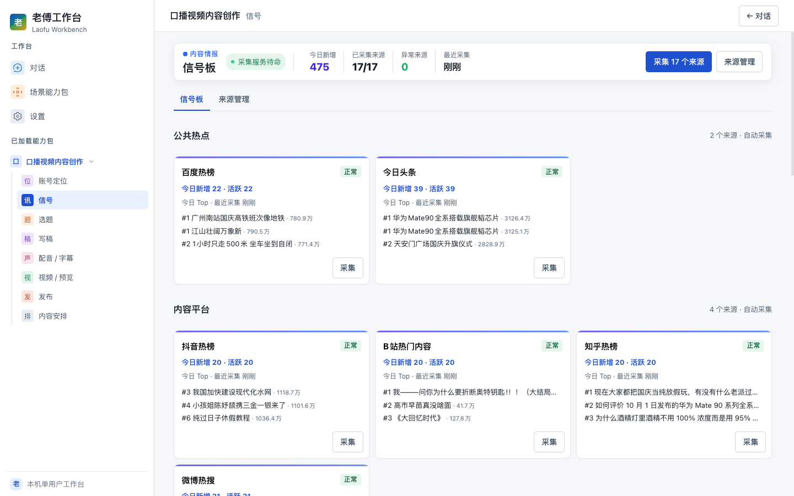
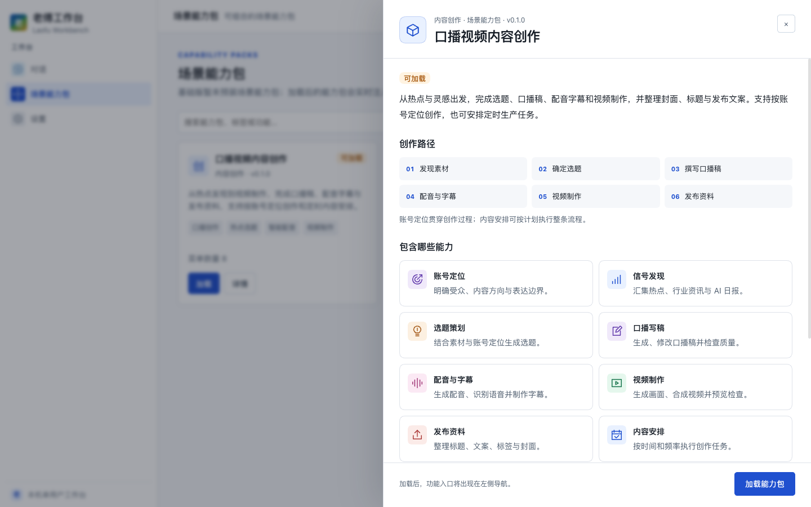
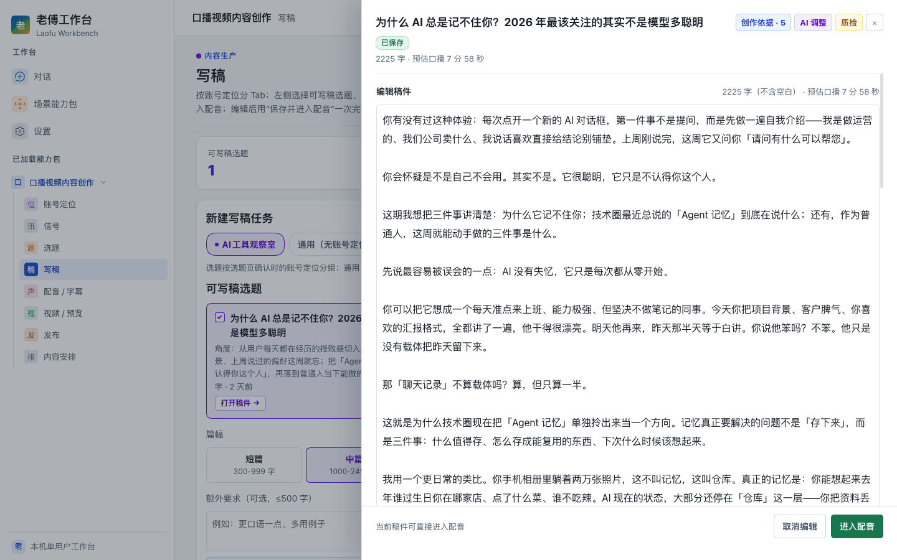
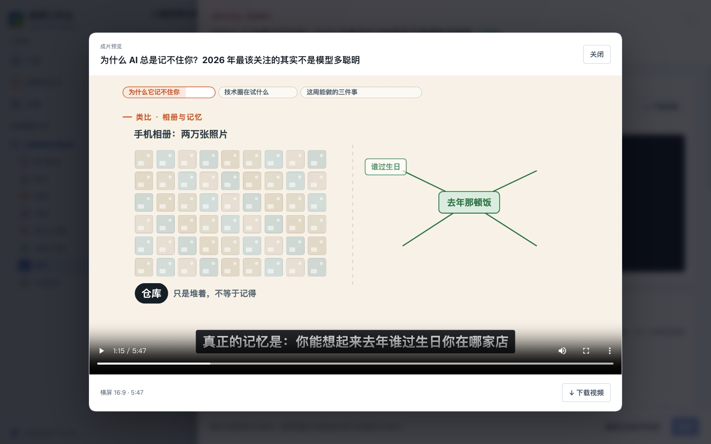
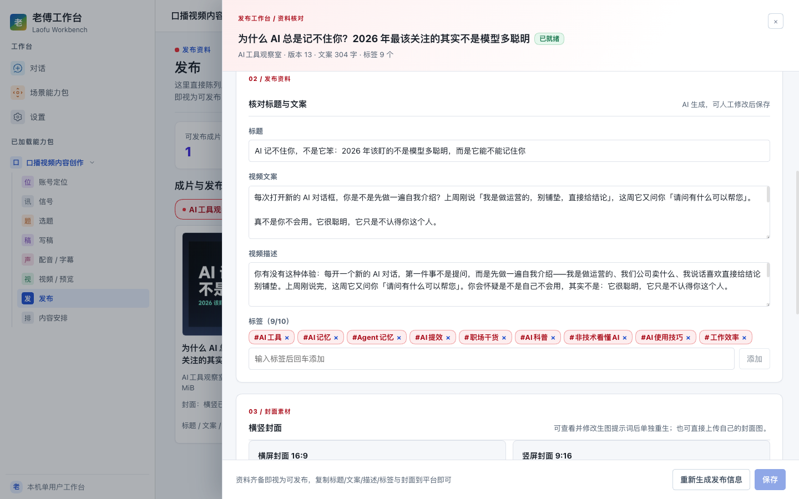

# 老傅工作台 · Laofu Workbench 社区版

**基于 [DeepSeek Harness（DSH）](https://github.com/deepseek-ai/deepseek-harness) 的可扩展 AI 工作台，通过可动态加载的「场景能力包」持续增加业务能力。**

工作台提供统一的对话、模型配置、工具执行和会话管理。你可以直接使用 AI 对话，也可以加载场景能力包，进入完整的业务流程。每个包拥有自己的页面、任务和数据，新场景可以作为独立包接入。

**社区版随仓库提供完整的「口播视频内容创作」能力包**：从发现素材、确定选题到写稿、配音字幕、制作视频和准备发布资料，也支持定时内容生产。

> 当前为开发预览版，面向本机单用户使用，主要验证环境为 macOS。支持 Web 和桌面开发入口；当前桌面发布格式为 Windows x64 与 macOS Apple Silicon 未签名便携包。运行时锁定 DSH `dsh-v0.2.0-rc.2`，具体版本以 [UPSTREAM.lock.json](lwb/UPSTREAM.lock.json) 为准。

[安装与启动](#快速开始) · [口播创作流程](#口播视频内容创作) · [社区版与商业版](#社区版与商业版) · [使用文档](#文档)

[](docs/images/community-workbench.png)

*社区版工作台：加载口播包后，左侧提供八个业务入口。以下截图均来自真实运行界面，点击可查看原图。*

## 社区版与商业版

**本 README 介绍社区版。** 社区版和商业版共用工作台核心，当前差异是发行包随带的场景能力包集合。商业版另包含私有的「模型博主测评」能力包，其源码不在本仓库中。

| 功能 | 社区版 | 商业版 |
|---|---|---|
| AI 对话、工作区、附件、工具与系统设置 | 支持 | 相同 |
| 能力包加载、卸载与专属工作区 | 支持 | 相同 |
| 口播视频内容创作的八个模块 | 完整提供 | 相同 |
| 模型博主测评 | 默认不随带 | 随带；使用需登录 LWB 并具有有效会员 |
| LWB 账号、积分购买与云端服务 | 支持，按服务端规则计费 | 相同 |
| 自带模型与百炼凭据（BYOK） | 支持 | 相同 |

**不登录 LWB 也能使用社区版。** 口播包加载不要求会员；AI 创作和媒体生成需要可用的模型、服务凭据及相应额度，可选择 LWB 服务或自有服务。社区版源码不附带免费调用额度，商业版或会员也不代表无限免费调用。

“社区版”是发行版本名称。当前公共源码采用 [PolyForm Noncommercial License 1.0.0](LICENSE)，属于源码可见的非商业许可，不是 OSI 认可的开源许可证。协议范围外的商业使用需另行取得书面授权；购买会员、积分或云端服务不自动获得源码商业授权。详见[许可证与商业使用](docs/licensing-and-commercial-use.md)。

桌面版本的构建清单、数据目录及开发环境加载规则见 [Desktop 与 Web：版本](docs/37-desktop-parity.md#版本edition)。

## 工作台与场景能力包

| 层次 | 提供什么 |
|---|---|
| 对话 | DSH 原生对话、工作区、附件、工具与执行记录 |
| 设置 | 模型服务商、默认模型、凭据、权限和审批等系统配置 |
| 场景能力包 | 按需加载的业务页面、任务流程、专属数据及业务接口 |

首次进入工作台时，先看到「对话」「场景能力包」「设置」。加载口播包后，左侧增加该包的八个业务入口；无需先创建普通对话或选择普通工作区。

能力包支持动态加载和卸载，菜单随之更新。已启用的包会在下次启动时自动恢复；卸载保留业务数据和连接配置。开发者可以按公开契约创建独立包，无需把具体业务写进工作台核心。

当前「场景能力包」页面是**本机包目录**：自动发现 `lwb/packs/` 内的包，以及通过 CLI 注册的外部本地包。它尚不提供在线包商店、远程下载或自动更新。

- 使用已有包：打开「场景能力包」，找到目标包并点击「加载」。
- 注册外部包：在项目根目录执行 `npm run pack:install -- /absolute/path/to/pack`，再到页面加载。
- 开发新包：阅读[能力包开发入门](docs/develop-a-pack.md)与[接口契约](docs/12-capability-packs.md)。

[](docs/images/community-pack-catalog.png)

*口播包详情：查看创作流程、功能列表与加载入口。*

能力包是运行在本机的 JavaScript 插件，专属工作区用于数据和任务归属，并不构成第三方代码的安全沙箱；请加载可信来源的包。

## 口播视频内容创作

手动创作按以下顺序推进，账号定位会为选题和写稿提供受众与表达要求：

```text
信号素材 → 选题 → 写稿 → 配音 / 字幕 → 视频 / 预览 → 发布资料
```

| 模块 | 当前能力 |
|---|---|
| 账号定位 | 管理多个内容创作档案，保存受众、内容方向和表达约束 |
| 信号 | 采集内置公开来源和 AI 内容日报，查看与筛选素材 |
| 选题 | 按账号、渠道与选题角度生成候选，加入待写稿 |
| 写稿 | 起稿、编辑、润色与稿件检查；启动写稿前确认任务 |
| 配音 / 字幕 | 使用 LWB 账号服务或用户自己的百炼服务生成配音，默认同时生成字幕 |
| 视频 / 预览 | DSH 创作 Agent 编写 Remotion 视频，通过技术质检和独立审片后展示成片 |
| 发布资料 | 生成、编辑标题、文案、标签和封面，预览及下载产物 |
| 内容安排 | 按计划推进到选题、写稿、成片质检或发布资料，查看每轮记录 |

[](docs/images/community-script.png)

*稿件编辑：围绕选题查看和修改正文，确认后进入配音。*

完成一条流程后，可以预览通过质检的成片，并下载视频、封面及发布资料。**发布模块不直接向视频平台发布**，最终发布由用户完成。

[](docs/images/community-video-preview.png)

*成片预览：示例为已通过质检的真实视频，播放器支持预览与下载。*

[](docs/images/community-publish.png)

*发布资料：核对标题、文案、描述与标签，并准备横竖封面，供自行上传到目标平台。*

使用时注意：

- 「账号定位」管理的是内容创作档案，不是 LWB 登录账号，也不用于绑定视频平台账号。
- 默认随配音生成字幕；字幕失败会保留已完成音频，可以单独重试。也可以直接输入文稿生成音频；要继续制作视频，应从关联项目的稿件进入配音。
- 内容安排运行在主机服务中。关闭浏览器不会停止调度，退出服务则无法到点执行，错过的时刻不自动补跑。选择推进到成片或发布资料时，会自动确认 AI 稿件并继续生产。

具体操作见[从安装到第一条视频](docs/quickstart.md#5-完成第一条内容)。

## 快速开始

### 环境准备

- Git。
- Node.js `^22.19.0 || >=24.0.0`，建议使用 Node.js 22 LTS 的最新补丁版本。
- npm、Corepack，以及本机 C/C++ 编译工具和开发头文件。macOS 可安装 Xcode Command Line Tools。
- 视频制作另需 `ffmpeg`、`ffprobe` 和 Chrome/Chromium 渲染浏览器。

首次安装需要访问 GitHub、npm 注册表及上游构建所需资源。根项目使用 npm 和 `package-lock.json`；`setup` 脚本进入 DSH 目录后通过 Corepack 使用上游锁定的 pnpm。根目录的 `packageManager` 字段不改变下面的 npm 安装流程。

### 安装与启动

```bash
git clone https://github.com/ScarecrowFu/dsh-laofu-workbench.git
cd dsh-laofu-workbench
npm ci
npm run setup
npm run dev -- --port 4173
```

`npm run setup` 获取并构建锁定版本的 DSH，放在被 Git 忽略的 `vendor/` 中。首次构建可能耗时较长。若提示缺少 Corepack 或编译工具，见[安装与故障排查](docs/troubleshooting.md)。

上面启动的是 Web 端。使用桌面开发端时，在完成安装和 setup 后，改为运行：

```bash
npm run dev:desktop
```

两端使用同一套页面和能力包。切换前先退出另一 Host，避免同时写入同一数据目录；当前桌面发布使用未签名便携包，详见 [Desktop 与 Web](docs/37-desktop-parity.md)。

启动会自动打开浏览器。需要手动打开时运行 `npm run dev -- --no-open --port 4173`，使用终端输出的完整 `http://127.0.0.1:4173/?token=...` 地址完成首次鉴权。不要分享访问令牌。

### 首次使用

先选择模型与媒体服务的配置方式，两类服务可分别选择：

| 配置 | 使用 LWB 服务 | 使用自己的服务（BYOK） |
|---|---|---|
| AI 创作模型 | 在「设置」登录 LWB，到「场景任务默认模型」指定可用的 LWB 模型并保存 | 在 DSH 系统设置中配置服务商、凭据和默认模型，场景任务保持「跟随 DSH 默认模型」，或单独指定已配置模型 |
| 配音与字幕 | 在「配音 / 字幕 → 连接配置」选择 LWB 账号 | 在同一入口选择百炼并保存媒体服务 API Key |
| 封面生图 | 在「发布 → 封面生图」选择 LWB 账号 | 在同一入口选择百炼并保存生图服务 API Key |

登录 LWB 不会自动选定场景任务模型。普通对话和场景任务的模型分别管理；配音、字幕及封面服务也不会随文本模型设置切换。

1. 配置可用的 AI 模型。
2. 打开「场景能力包」，加载「口播视频内容创作」；随仓库提供的包无需另行执行安装命令。
3. 创建内容账号定位，或使用「通用（无账号定位）」；检查信号，生成选题并完成一篇短稿。
4. 配置媒体服务、FFmpeg 和渲染浏览器，从该项目稿件生成配音、字幕和视频。
5. 在「发布」预览通过质检的成片，整理并下载发布资料，自行发布到目标平台。

详见[从安装到第一条视频](docs/quickstart.md)。可以先验证对话和选题写稿，再配置媒体制作依赖。

## 数据与配置

源码启动的默认产品数据根为 `lwb/local/current/`，包括能力包登记、DSH 设置、凭据、会话和创作产物；`lwb/local/` 不提交到 Git。原生附件和业务数据位置见[运行数据目录](docs/31-runtime-data-layout.md)。

启动器**不会自动加载 `.env`**。[.env.example](.env.example) 仅用于说明可选变量；在启动终端中用 `export` 设置，例如：

```bash
export LWB_REMOTION_BROWSER_EXECUTABLE="/Applications/Google Chrome.app/Contents/MacOS/Google Chrome"
npm run dev -- --port 4173
```

更新或迁移前，停止服务并备份完整 `lwb/local/`；若自定义了数据目录，还需备份对应位置。包的“清空业务数据”会保留可恢复副本，与“卸载”含义不同。

## 开发与贡献

```bash
npm test
```

完成依赖安装和 DSH 构建后，上述命令执行语法检查、基础/能力包 Profile 检查及单元测试。真实模型和媒体接口需要另外配置并验收，测试通过不代表所有外部服务均可用。

欢迎提交问题、文档改进与场景能力包。请先阅读[贡献指南](CONTRIBUTING.md)，问题反馈入口为 [GitHub Issues](https://github.com/ScarecrowFu/dsh-laofu-workbench/issues)。

## 文档

- [快速开始](docs/quickstart.md)：配置 LWB 或自有模型并完成第一次创作。
- [Desktop 与 Web](docs/37-desktop-parity.md)：双端启动、版本构建清单、共享数据与发行包现状。
- [许可证与商业使用](docs/licensing-and-commercial-use.md)：非商业使用、商业授权、服务和第三方边界。
- [故障排查](docs/troubleshooting.md)：安装、访问、模型和媒体任务问题。
- [开发场景能力包](docs/develop-a-pack.md)：创建、注册和动态加载独立包。
- [总体架构](docs/01-architecture.md)与[上游版本管理](docs/08-base-lock.md)。
- [文档索引](docs/README.md)：当前指南、开发契约与历史设计记录。

## 许可证与致谢

当前版本的项目自有代码（包括公开的口播视频能力包）采用 [PolyForm Noncommercial License 1.0.0](LICENSE)：在协议允许的范围内可使用、修改和分发；其他用途（例如一般企业商业使用、商业托管或收费交付）需另行取得授权，具体以协议原文和实际用途为准。购买 LWB 会员、积分或云端服务不自动获得源码商业授权。该许可证属于源码可见的非商业许可，不是 OSI 认可的开源许可证。历史上已按 MIT 发布的版本继续适用其原许可证，当前许可不追溯撤销已经授予的权利。具体边界见[许可证与商业使用](docs/licensing-and-commercial-use.md)。

感谢 DeepSeek Harness 提供运行时，以及 React、Remotion 等项目提供基础能力。上游 DSH 和所有第三方依赖、素材、字体及外部服务继续遵循各自的许可证和服务条款，不因本项目许可证而改变。

第三方依赖和附带资源的许可独立于本项目，特别是 Remotion 使用其自身许可。来源、许可边界和待补充的素材出处见[第三方组件与资源说明](THIRD_PARTY_NOTICES.md)。
